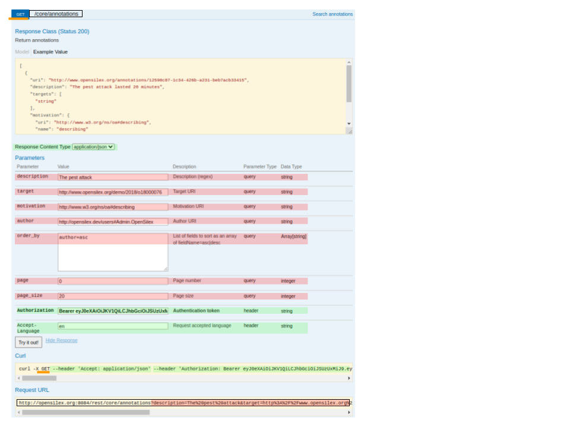
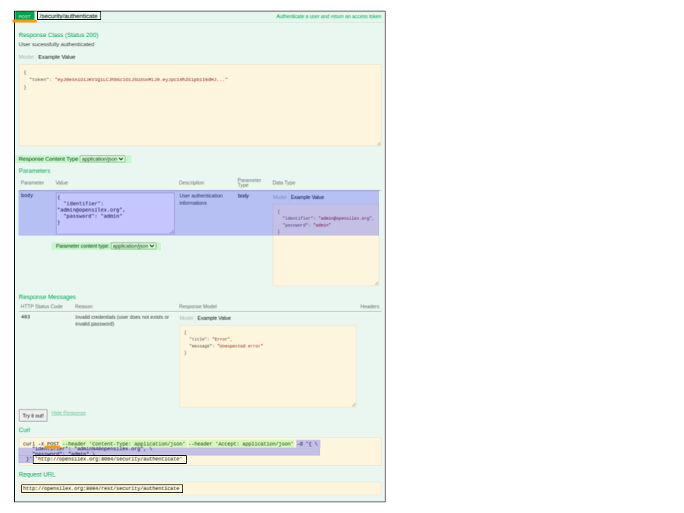
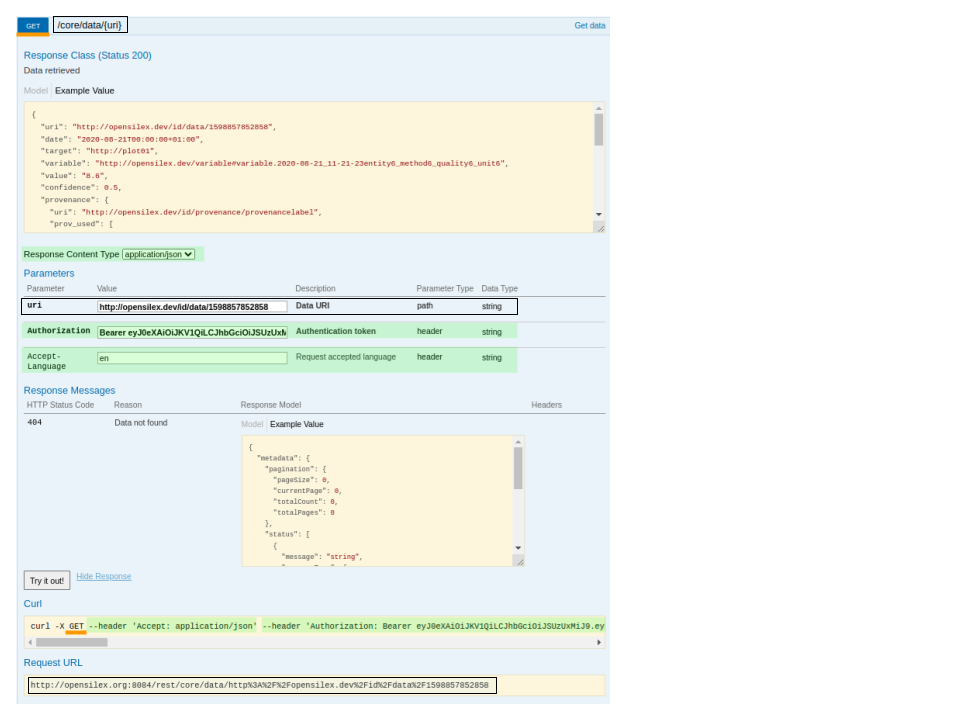

# opensilexR

A set of basic functions to facilitate access to the data of an opensilex instance. This package is purposely "low level", and its source code can easily be adapted and reused for custom or more specific need to call the opensilex API.

# Installation

```R
library(remotes)
install_github("guilhemheinrich/R-opensilex-package")
```

# Usage

There is (mainly) two ways this package can be used: either directly to quickly get data when we know an **experiment uri** (and we get a credential allowing access to it), and some utility functions to build more complex scenarios when using the opensilex API.

## Quick data example

Retrieve data from the public phis's opensilex public instance.


Let's start by setting up authorization and our target:

```R
configuration <- list(
  host = "http://opensilex.org:8084/rest",
  user = "guest@opensilex.org",
  password = "guest",
  experiment_uri = "http://www.phenome-fppn.fr/m3p/ARCH2017-03-30",
  scientific_object_type = "vocabulary:Plant" 
)
```

First we will get all data relative to our scientific object: it can be factor level or germplasm for example.
```R
os_modalities <- opensilexR::get_scientific_object_modalities(
    host = configuration$host,
    user = configuration$user,
    password = configuration$password,
    experiment_uri = configuration$experiment_uri,
    scientific_object_type = configuration$scientific_object_type
)
```
os_modalities is a *data.frame* and can be explored by the usual ways
```R
summary(os_modalities)
head(os_modalities)
```

and to retrieve the actual data ("directly") linked to those scientific objects: 
```R
data <- opensilexR::get_data(
    host = configuration$host,
    user = configuration$user,
    password = configuration$password,
    experiment_uri = configuration$experiment_uri,
    scientific_object_type = configuration$scientific_object_type
)
```

we can also specified one or more variables
```R
data <- opensilexR::get_data(
    host = configuration$host,
    user = configuration$user,
    password = configuration$password,
    experiment_uri = configuration$experiment_uri,
    scientific_object_type = configuration$scientific_object_type,
    variables = c(
      "publictest:id/variable/leaf_area_imageanalysis_squaremeter", "publictest:id/variable/plant_height_imageanalysis_millimetre"
    )
)
```
data is also a *data.frame*.
```R
summary(data)
head(data)
```

Those two functions should get you started very quickly, but for those who want finer control over what data they want, and when, the full opensilex api is available.

See next chapter !

## Methodology
The two previous functions mainly use the *httr* and *jsonlite* packages. Those are considered quite "low level" and should work on a vast range of R versions.

To make your own call, we will take a look at the previous function implementation to get a rough idea of how we can handle the request, and we will link it to the api-docs of the opensilex instance you want to interact with (or any other rest API made by *swagger/openAPI*).

We can decompose an http request into three parts. Those are:
 1) The request type
 2) The url path
 3) The various parameters

To better explain how to interact with a RESTFUL API, I will highlight the correspondence between a *httr* request and the api-docs (made by *swagger/openAPI*).

We will consider the following three annotated screenshots from an opensilex/api-docs instance (made by *swagger/openAPI*).

1) Figure 1: the **GET /core/annotation**


2) Figure 2: the **POST /security/authenticate**


3) Figure 3: the **GET /core/data/{uri}**



In those three screenshots:
- the underlined orange text is information relative to the request type,
- the surrounded text is information relative to the path,
- the highlighted text is information relative to parameters with:
  - header parameters in green
  - path parameters in transparent/surrounded (same as path information)
  - body parameters in blue
  - query parameters in red

Bold parameters are required parameters.

As I think some example are better that a long speech, we will see how each of those api-docs screenshots can be "translated" in R using this package, in conjunction with *httr* and *jsonlite*.


1) the **GET /core/annotation**
The first query has the form that we will most widely use as a data consumer: a GET query, with various query parameters, which require an authentication token.
We will use the utilities functions provided in the package to ease the boilerplate code, but this is not mandatory.
```R
# Use the included get_token function to retrieve token
token <- opensilexR::get_token(
  host = configuration$host,
  user = configuration$user,
  password = configuration$password
)

# Write the URL of the query
call1 <-
  paste0(
    configuration$host,
    "/core/annotations",
    # Use the utilitary function nof the package to parse a list of query parameters.
    # Or don't if you does'nt want.
    opensilexR::parse_query_parameters(
      description = "The pest attack",
      target = "http://www.opensilex.org/demo/2018/o18000076",
      motivation = "http://www.w3.org/ns/oa#describing",
      author = "http://opensilex.dev/users#Admin.OpenSilex",
      order_by = "author=asc",
      page = 0,
      page_size = 20
    )
  )
print(call1)
# NOTE: the previous print should be exactly identical to the surrounded requested URL in request URL part of the first picture

# Use the utilitary function to parse the response object,
# Logging information about the request, 
# and printing the global status
get_result <- opensilexR::parse_status(
  # This request is a GET request
  httr::GET(call1, httr::add_headers(Authorization = token))
)
# If everything is fine, you should see a "Querry success" message
# Else you have a short description of the problem, with additional information in the log (see logging package)

# Parse the Response content as text, then interpret it as a JSON, which is then transformed as a R's named list.
# Note that this information is given by the Content-Type: application/json header, which is by default (that's why we don't add it in the header part of the request)
get_result_text <- httr::content(get_result, "text")
get_result_json <- jsonlite::fromJSON(get_result_text, flatten = TRUE)
get_result_json$result
# Although, as the default query parameters doesn't refer to anything in our base,
# the result is actually empty

```

2) the **POST /security/authenticate**
This code snippet is the core of the opensilexR::get_token utility function.


```R
call0 <- paste0(host, "/security/authenticate")
print(call0)
# NOTE: the previous print should be exactly identical to the surrounded requested URL in request URL part of the second picture. It is quite a short URL, as the authentication credential are passed into the body of the request.


post_authenticate <- opensilexR::parse_status(
  # This request is a POST request
    httr::POST(
      call0,
      # It is a POST request, which have its arguments passed as a body parameter, and *not* as a multiple query parmaters like previous request.
      # As we precised the Content-Type to be an application/json format, we need to pass this argument as a valid JSON object.
      body = paste0('{
        "identifier": "', configuration$user, '",
        "password": "', configuration$password, '"
        }'
      ),
      httr::add_headers(
        `Content-Type` = "application/json",
        Accept = "application/json"
    )
  )
)

# Handling the response back is done the same way as previously:
# by casting the buffer as "text", and then this text as JSON.
post_authenticate_text <- httr::content(post_authenticate, "text")
post_authenticate_json <- jsonlite::fromJSON(
  post_authenticate_text,
  flatten = TRUE
)

# Finaly, we just pick the token
token <- post_authenticate_json$result$token
```

3) the **GET /core/data/{uri}**
This request is very similar to the first one, but we pass the uri of our intended datum as a path parameter, and not as a query parameter. Both "live" in the URL, but this one is in the path, before any query parameters, delimited by a "?" symbol, and subsequent "&" symbols.
```R
# Use the included get_token function to retrieve token
token <- opensilexR::get_token(
  host = configuration$host,
  user = configuration$user,
  password = configuration$password
)

# Write the URL of the query
call1 <-
  paste0(
    configuration$host,
    "/core/data/",
    utils::URLencode("http://opensilex.dev/id/data/1598857852858", reserved = TRUE)
  )
  
print(call1)
# NOTE: the previous print should be exactly identical to the surrounded requested URL in request URL part of the third picture

# Use the utilitary function to parse the response object,
# Logging information about the request, 
# and printing the global status
get_result <- opensilexR::parse_status(
  # This request is a GET request
  httr::GET(call1, httr::add_headers(Authorization = token))
)
# If everything is fine, you should see a "Querry success" message 
# BUT, as the uri requested is part of the path and that uri does'nt exist on that instance,
# we get an "Client error.\n See logs for more information" as well as an "ERROR::404 Not Found" logging information

# Parse the Response content as text, then interpret it as a JSON, which is then transformed as a R's named list.
# Note that this information is given by the Content-Type: application/json header, which is by default (that's why we don't add it in the header part of the request)
get_result_text <- httr::content(get_result, "text")
get_result_json <- jsonlite::fromJSON(get_result_text, flatten = TRUE)
get_result_json$result
```

## Known issues
